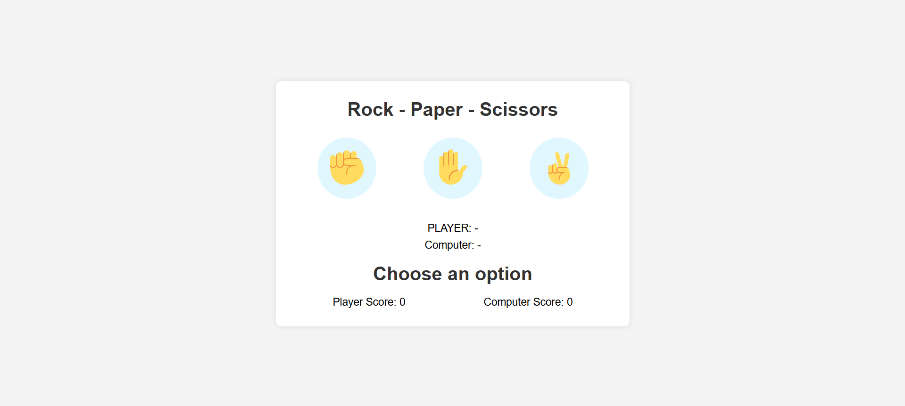

# Rock Paper Scissors Game

A simple, interactive Rock Paper Scissors game built with HTML, CSS, and JavaScript.

## Overview

This project is a classic implementation of the Rock Paper Scissors game where players can compete against the computer. The game features a clean, modern interface with emoji icons for rock, paper, and scissors choices.

## Features

- Interactive UI with hover effects
- Real-time score tracking
- Visual feedback for game results (win/lose/tie)
- Responsive design that works on desktop and mobile devices

## How to Play

1. Open the `index.html` file in your web browser
2. Click on one of the three options (rock, paper, scissors)
3. The computer will randomly choose its option
4. The game will display both choices and the result
5. Scores are automatically updated after each round

## Game Rules

- Rock beats Scissors
- Scissors beats Paper
- Paper beats Rock
- Identical choices result in a tie

## Files Structure

- `index.html` - Main HTML structure of the game
- `style.css` - All styling and responsive design rules
- `script.js` - Game logic and event handling
- `screenshots/` - Contains game screenshots

## Technologies Used

- HTML5
- CSS3
- JavaScript (ES6)
- Twitter Emoji (Twemoji) for game icons

## Customization

You can easily customize this game by:

- Modifying the CSS in `style.css` to change colors, sizes, and layout
- Adding additional game logic in `script.js` 
- Extending the HTML structure to add new features or game modes

## Browser Compatibility

The game works in all modern browsers including:
- Chrome
- Firefox
- Safari
- Edge
